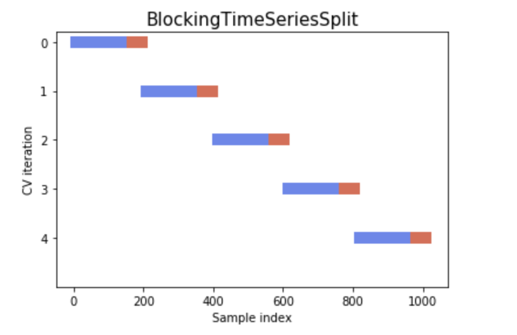
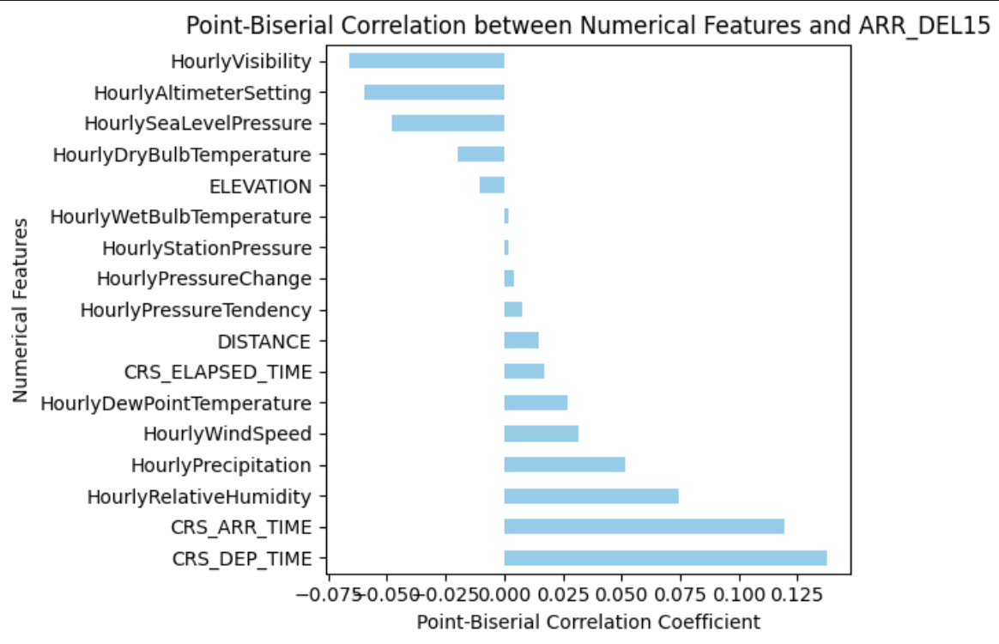

# **Flight Delay Prediction with Parallelized Training**
By: Alec Naidoo, Jian Wang, Patrick Yim, Trisha Sanghal

[Analysis](Team_Analysis.html)
[Presentation](Final_Presentation.pdf)

## **Overview**
Predicting flight delays accurately is essential for optimizing airline operations, minimizing passenger disruptions, and advancing research in the aviation industry. This project tackles the challenge of processing over 31 million rows of flight and weather data by leveraging distributed frameworks and scalable storage formats.

The primary goal is to develop a binary classification model that predicts whether a flight within the U.S. will experience an arrival delay of 15 minutes or more. By integrating advanced machine learning techniques with efficient data handling and feature engineering, this project provides actionable insights for the aviation sector.

---

## **Key Features**
- **Overcoming Data Scale Challenges**:
  - Processed 31+ million rows using **PySpark** and stored intermediate results in **Parquet files** for optimized read/write operations.
  - Utilized **Azure cloud computing** to manage large-scale distributed processing efficiently.
- **Advanced Feature Engineering**:
  - Implemented the **PageRank algorithm** as feature to measure airport centrality, capturing traffic flow and its impact on delay likelihood.
- **Addressing Class Imbalance**:
  - Applied **SMOTE (Synthetic Minority Oversampling Technique)** to balance the dataset and improve model performance for the minority delay class.
- **Robust Cross-Validation**:
  - Used a **blocking time series split** strategy to ensure realistic evaluation of temporal patterns, mimicking real-world operational conditions.

---

## **Datasets**
This project integrates and processes three primary datasets for flights within the United States, spanning 2015-2019:
1. **Flight On-Time Performance Data** (U.S. Department of Transportation): Flight schedules, delays, and performance metrics.  
2. **Weather Data** (NOAA): Hourly weather observations for origin and destination airports.  
3. **Airport Metadata** (U.S. Department of Transportation): Geographical and operational information for U.S. airports.  

All datasets were transformed and optimized using Parquet files to handle the high data volume efficiently.

    

---

## **Methodology**

### **1. Data Preprocessing**
- Integrated datasets into a unified pipeline using **PySpark**, leveraging distributed processing for scalability.  
- Transformed CSV data into **Parquet files** for faster data access and reduced storage overhead.  
- Conducted extensive feature engineering, including graph-based features like **PageRank** to capture airport connectivity and its correlation with delays.

### **2. Modeling**
- Developed baseline models (e.g., majority class and random predictors) to establish minimum performance benchmarks.  
- Trained advanced models such as **Logistic Regression**, **Random Forest**, and **Neural Networks** using PySpark and scikit-learn.  

### **3. Addressing Class Imbalance**
- Implemented **SMOTE** to oversample the minority delay class, improving classification performance.  

### **4. Evaluation**
- Used **blocking time series split** cross-validation to evaluate models on temporally ordered data, ensuring robust performance metrics that mirror real-world scenarios.  
- Optimized models for **F1 score**, achieving a 7% improvement over baseline predictors.

---

## **Results**
- **Baseline Models**:
  - Majority class predictor: F1 = 71.96%.  
  - Random prediction: F1 = 55.14%.  
- **Advanced Model Exploration**:
  - Logistic Regression: Delivered key insights into critical features like `airline_performance` and `DISTANCE`.  
    - Achieved the highest performance with a **7% improvement in F1 score** over the best baseline.  

---

## **Next Steps**
- Fine-tune Neural Networks and test Transformer-based architectures for enhanced time-series predictions.  
- Investigate the impact of advanced graph-based features for further improvements in prediction accuracy.
